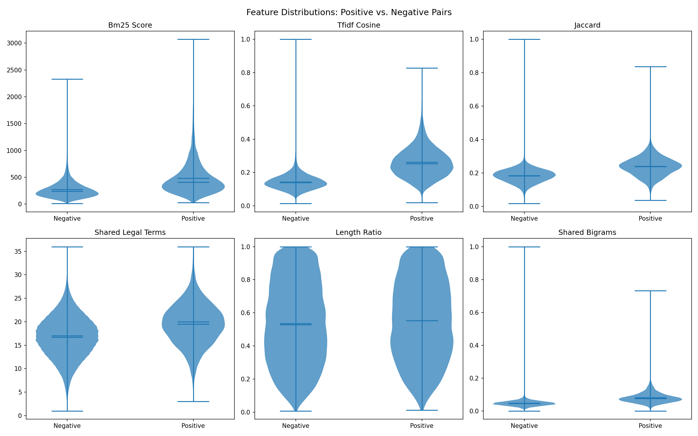
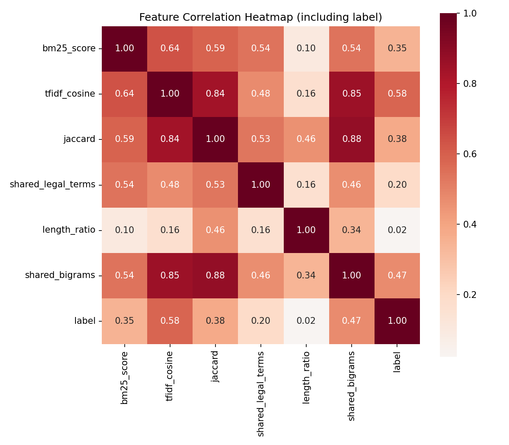
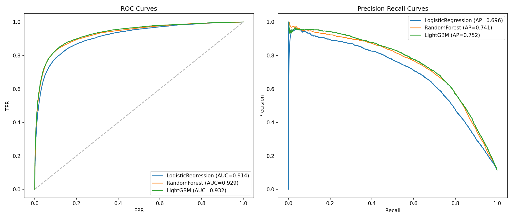
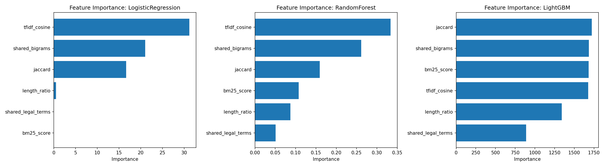
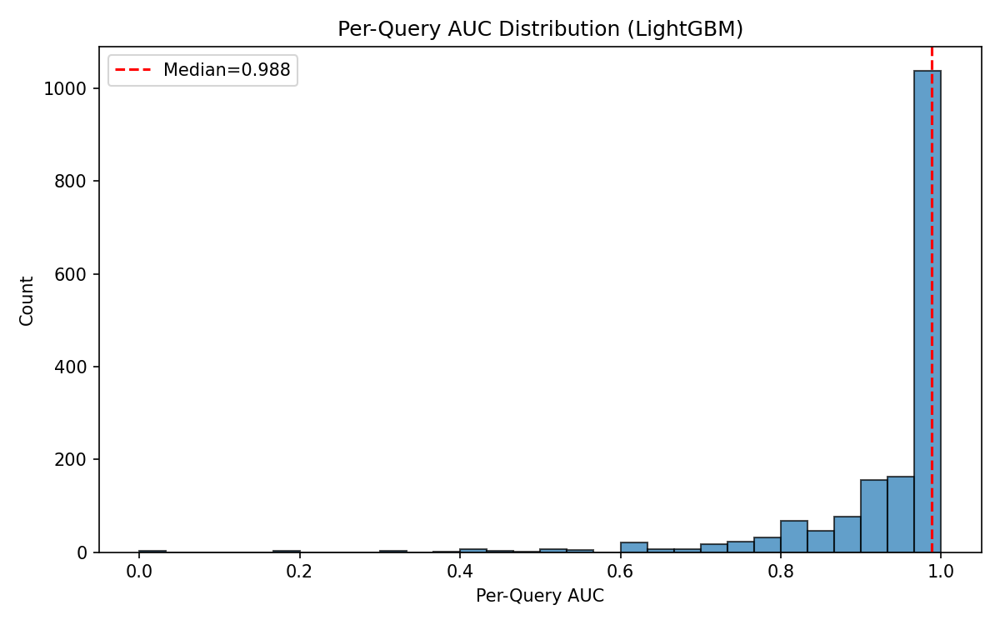
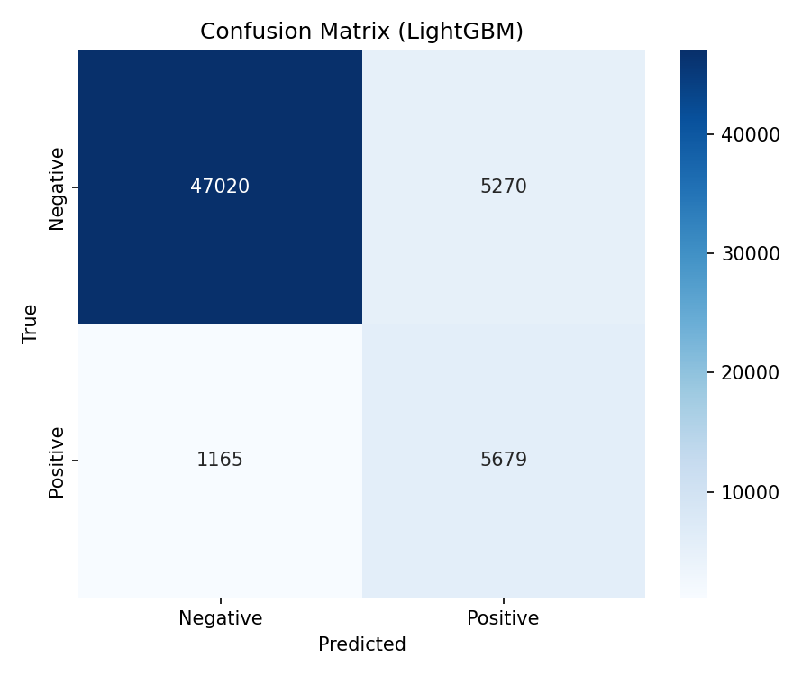

# Task 1 Label Signal Validation Report

## Objective

Verify that the golden truth labels in COLIEE Task 1 carry real discriminative signal — i.e., that noticed (cited) cases are meaningfully different from random candidates when measured with text-based features. This validates that the task is solvable with lexical retrieval methods and reveals which signals are most useful for building a competition pipeline.

## Methodology

### Dataset

- **Corpus:** 7,350 Federal Court of Canada case documents (training set)
- **Labels:** 1,678 queries with 6,881 total citation links
- **Average citations per query:** ~4.1

### Pair Sampling

For each query, all its positive (cited) candidates were paired, plus up to 10x random negatives per positive (capped at 50 negatives per query), yielding:

- **59,134 total pairs:** 6,844 positive, 52,290 negative (~1:7.6 ratio)

### Features (6 per pair)

| Feature | Description |
|---------|-------------|
| **BM25 score** | Okapi BM25 relevance score (k1=1.5, b=0.75) |
| **TF-IDF cosine** | Cosine similarity over 50K-feature TF-IDF vectors (sublinear TF, L2-normalized) |
| **Jaccard** | Jaccard similarity of unique token sets |
| **Shared legal terms** | Count of shared domain-specific legal terms (from a curated set of 40 terms) |
| **Length ratio** | min(len_q, len_c) / max(len_q, len_c) |
| **Shared bigrams** | Jaccard similarity of word bigram sets |

### Preprocessing

- Removed `<FRAGMENT_SUPPRESSED>` placeholders and `[End of document]` markers
- Rejoined broken statute names (lines starting with lowercase)
- Collapsed multiple blank lines

### Evaluation Protocol

- **5-fold GroupKFold cross-validation**, grouped by query to prevent data leakage (no query appears in both train and test within a fold)
- **Class balancing:** `class_weight='balanced'` (LogReg, RF) or `is_unbalance=True` (LightGBM)
- Three classifiers tested: Logistic Regression, Random Forest, LightGBM

---

## Results

### 1. Statistical Tests

All six features show highly significant differences between positive and negative pairs (p < 1e-7 across the board):

| Feature | Pos Mean | Neg Mean | Welch's t | p-value | KS Stat | Cohen's d |
|---------|----------|----------|-----------|---------|---------|-----------|
| BM25 score | 484.94 | 272.34 | 57.00 | ~0 | 0.389 | **1.169** |
| TF-IDF cosine | 0.261 | 0.143 | 105.84 | ~0 | 0.646 | **2.244** |
| Jaccard | 0.239 | 0.184 | 77.32 | ~0 | 0.473 | **1.290** |
| Shared legal terms | 19.50 | 16.74 | 48.24 | ~0 | 0.242 | 0.622 |
| Length ratio | 0.554 | 0.536 | 5.58 | 2.5e-8 | 0.036 | 0.070 |
| Shared bigrams | 0.081 | 0.047 | 81.83 | ~0 | 0.590 | **1.679** |

**Key observations:**
- **TF-IDF cosine** has the largest effect size (Cohen's d = 2.244), meaning cited cases have substantially higher textual similarity to their query than random cases.
- **Shared bigrams** (d = 1.679) and **Jaccard** (d = 1.290) are also highly discriminative, confirming strong lexical overlap between citing and cited documents.
- **BM25 score** (d = 1.169) provides meaningful signal despite the long document lengths.
- **Length ratio** is near-negligible (d = 0.070) — document length alone is not a useful discriminator.
- **Shared legal terms** shows a moderate effect (d = 0.622), indicating some domain vocabulary overlap but with limited discriminative power on its own.

### 2. Feature Distributions



The violin plots show clear distributional shifts between positive and negative pairs for BM25, TF-IDF cosine, Jaccard, and shared bigrams. Positive pairs have heavier upper tails across all similarity features. Length ratio distributions overlap almost entirely, confirming its low discriminative value.

### 3. Feature Correlations



Notable correlation patterns:
- **TF-IDF cosine** has the highest correlation with the label (r = 0.58), followed by shared bigrams (0.47), Jaccard (0.38), and BM25 (0.35).
- **TF-IDF cosine, Jaccard, and shared bigrams** are highly intercorrelated (r = 0.84-0.88), which is expected since they all measure lexical overlap in different ways.
- **BM25** is moderately correlated with the other lexical features (r = 0.54-0.64) but captures additional signal through its document-length normalization and term-frequency saturation.
- **Length ratio** is weakly correlated with everything (r = 0.02 with label), confirming it adds little value.
- Despite high feature intercorrelation, the ensemble of all features outperforms any single feature, indicating each captures complementary aspects.

### 4. Classifier Performance

| Model | Mean AUC | Std | Mean AP | Std |
|-------|----------|-----|---------|-----|
| Logistic Regression | 0.9140 | 0.0038 | 0.6962 | 0.0095 |
| Random Forest | 0.9285 | 0.0027 | 0.7405 | 0.0078 |
| **LightGBM** | **0.9323** | **0.0032** | **0.7520** | **0.0049** |

All three classifiers achieve AUC > 0.91, with LightGBM performing best. Low standard deviations across folds indicate stable, reliable signal.

#### Per-fold breakdown (LightGBM):

| Fold | AUC | AP |
|------|-----|----|
| 0 | 0.9328 | 0.7517 |
| 1 | 0.9347 | 0.7568 |
| 2 | 0.9274 | 0.7474 |
| 3 | 0.9303 | 0.7461 |
| 4 | 0.9365 | 0.7583 |

#### Classification report (LightGBM, threshold=0.5):

|  | Precision | Recall | F1 |
|--|-----------|--------|----|
| Negative | 0.98 | 0.90 | 0.94 |
| Positive | 0.52 | 0.83 | 0.64 |
| **Accuracy** | | | **0.89** |

The model achieves high recall on positives (0.83) at the cost of precision (0.52), which is appropriate for a retrieval first stage where recall matters most.

### 5. ROC and Precision-Recall Curves



- **ROC curves** show all models well above the diagonal, with LightGBM and Random Forest nearly overlapping.
- **PR curves** show that precision remains above 0.90 up to ~15% recall, then degrades gradually. This suggests a viable high-precision retrieval cutoff exists for the top candidates.

### 6. Feature Importance



Feature importance rankings across all three models:

| Rank | Logistic Regression | Random Forest | LightGBM |
|------|-------------------|---------------|----------|
| 1 | TF-IDF cosine | TF-IDF cosine | Jaccard |
| 2 | Shared bigrams | Shared bigrams | Shared bigrams |
| 3 | Jaccard | Jaccard | BM25 score |
| 4 | Length ratio | BM25 score | TF-IDF cosine |
| 5 | Shared legal terms | Length ratio | Length ratio |
| 6 | BM25 score | Shared legal terms | Shared legal terms |

**TF-IDF cosine**, **shared bigrams**, and **Jaccard** are consistently the top-3 features across model types. BM25 ranks higher in tree-based models that can exploit its non-linear score distribution. Shared legal terms and length ratio contribute least.

### 7. Per-Query AUC Distribution



- **Median per-query AUC: 0.988** — the vast majority of queries are near-perfectly separable with lexical features alone.
- The distribution is heavily right-skewed: ~1,040 queries (out of ~1,670 evaluable) achieve AUC > 0.95.
- A small tail of ~30-50 "hard" queries have AUC < 0.6, indicating cases where lexical similarity fails and semantic understanding is needed.

### 8. Confusion Matrix (LightGBM)



At the 0.5 decision threshold:
- **True negatives:** 47,020 (90% of negatives correctly rejected)
- **True positives:** 5,679 (83% of positives correctly identified)
- **False positives:** 5,270 (10% of negatives incorrectly flagged)
- **False negatives:** 1,165 (17% of positives missed)

---

## Verdict: STRONG Signal

The golden truth labels carry **strong discriminative signal** from simple lexical features:

- **AUC = 0.932** with just 6 hand-crafted features
- **All statistical tests** reject the null hypothesis at extreme significance levels
- **Median per-query AUC = 0.988**, meaning most queries are trivially separable

## Implications for Competition Strategy

1. **BM25 + TF-IDF is a strong first-stage retriever.** A simple lexical pipeline can already identify the majority of cited cases with high recall. This should serve as the first stage in any pipeline.

2. **Neural reranking should target the hard tail.** The ~30-50 queries with low per-query AUC are where semantic models (fine-tuned legal transformers, dense retrieval) will add the most value. These are likely cases where the citation relationship is based on legal reasoning rather than shared terminology.

3. **Feature redundancy is manageable.** While TF-IDF cosine, Jaccard, and shared bigrams are highly correlated (r > 0.84), they each contribute to classifier performance. A practical pipeline should use TF-IDF cosine or BM25 as the primary retrieval signal, with others as reranking features.

4. **Length ratio and shared legal terms are weak signals.** These can be dropped or deprioritized in feature engineering. The legal term set may need expansion or refinement to be more useful.

5. **Class imbalance is significant but manageable.** With ~4 citations per query out of 7,350 candidates (0.05% positive rate in the full retrieval setting), a first-stage retriever must be high-recall. The 83% recall at threshold=0.5 on the sampled dataset is encouraging but will need to be much higher when applied to the full candidate set.

---

## Reproducibility

```bash
uv sync
uv run python src/analysis/label_signal_validation.py
```

- Runtime: ~50 seconds
- Output: statistical tables to stdout, 6 plots to `../plots/`
- Random seed: 42 (deterministic results)

## Generated Plots

| File | Description |
|------|-------------|
| `../plots/12_signal_feature_distributions.png` | Violin plots of all 6 features, positive vs. negative |
| `../plots/13_signal_correlation_heatmap.png` | Pairwise feature + label correlation matrix |
| `../plots/14_signal_roc_pr.png` | ROC and Precision-Recall curves for all 3 classifiers |
| `../plots/15_signal_feature_importance.png` | Feature importance bar charts per model |
| `../plots/16_signal_per_query_auc.png` | Histogram of per-query AUC scores (LightGBM) |
| `../plots/17_signal_confusion_matrix.png` | Confusion matrix at threshold=0.5 (LightGBM) |
